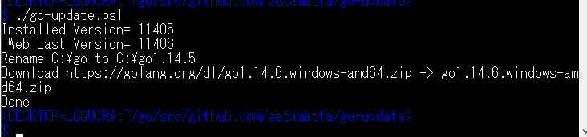

go-update.ps1
=============

Download and swap the current installed-go and the latest Go package 
uploaded on https://golang.org/dl/

How to use
-----------

1. Exec **`powershell -ExecutionPolicy RemoteSigned -file go-update.ps1`**
2. The script do below
    - Downloads the latest version of the go package `go-X.Y.Z.windows.amd64.zip`
    - Rename `C:\go` to `C:\go-(the-current-installed-version)`
    - Unzip it to `C:\go`
